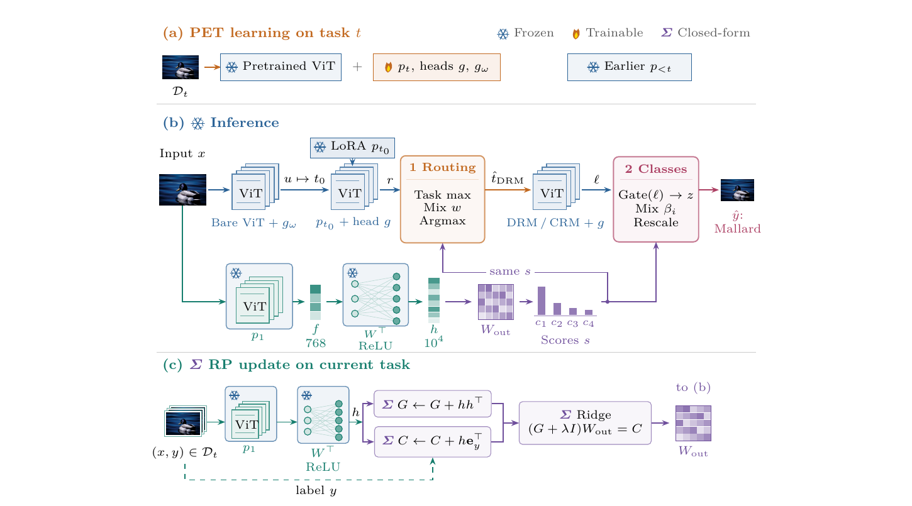

<div align="center">

<h1>Two-Stage Fusion for Routing and Classification in Parameter-Efficient Continual Learning</h1>

<p>Thien Truong Nguyen · Quang Thai Tong · Thanh-Nga Hoang Thi · Quynh-Trang Pham Thi</p>

<h3>SOICT 2026</h3>

</div>

---

## Abstract

Parameter-efficient continual learning can preserve a pre-trained backbone by assigning compact adapters to incoming tasks. In the task-agnostic setting, however, inference couples two distinct decisions: selecting an adapter and recognising a class among all classes seen so far. These decisions are not equivalent, so a routing correction may leave classification unchanged or disrupt a prediction that was already correct.

We introduce a two-stage fusion framework that augments an adapter-based pipeline with a complementary random-projection ridge head. The head works in a fixed feature space and is updated from accumulated second-order statistics, without retaining past examples or adding gradient updates to existing adapters. Its scores first refine the task proposal before re-matching and then support confidence-aware fusion with the final class logits.

Evaluation across multiple datasets, seeds and pre-training settings examines routing, classification and retention separately, showing that the two evidence sources are complementary while their effects remain configuration-dependent.

## Pipeline

<p align="center">
  
</p>

The random-projection scores are reused at two points: task routing and gated class-score fusion. The pre-trained backbone and earlier PET modules remain frozen.

## Requirements

- Python 3.12
- PyTorch and torchvision with CUDA support
- timm == 0.6.7
- An NVIDIA GPU; the reported experiments used an RTX 4090

Install the dependencies in a dedicated environment:

```bash
python3 -m venv .venv
.venv/bin/python -m pip install -r requirements.txt
```

## Usage

Prepare ImageNet-A and 5-Datasets when needed:

```bash
.venv/bin/python tools/prepare_datasets.py \
  --which all \
  --root /path/to/datasets
```

Train the task-identity module and LoRA pool. For example, ImageNet-R with seed 42:

```bash
DATASETS_ROOT=/path/to/datasets \
OUTPUT_ROOT=/path/to/output \
DATASET=imr SEED=42 \
bash training_scripts/train_any_4090.sh
```

Evaluate the full two-stage fusion model:

```bash
DATASETS_ROOT=/path/to/datasets \
OUTPUT_ROOT=/path/to/output \
DATASET=Split-Imagenet-R CONFIG=imr_lora SEED=42 NUM_TASKS=10 \
TII_DIR=/path/to/output/imr_tii_original_10tasks_seed42 \
RP_FUSE=1 RP_FUSE_DRM=1 RP_FUSE_W=0.7 \
RP_CLS_GATE=margin RP_CLS_W=0.5 RP_CLS_MIN=1 CALIBRATE=0 \
bash training_scripts/eval_rp_head_any_4090.sh \
  /path/to/output/imr_lora_rank8_baseline_10tasks_seed42
```

Run the tests:

```bash
.venv/bin/python -m pytest tests/ -q
```

The implementation builds on [HRM-PET](https://github.com/wei-cheng777/HRM-PET). The random-projection ridge head follows [RanPAC](https://github.com/McDonnell-Research-Lab/RanPAC).
